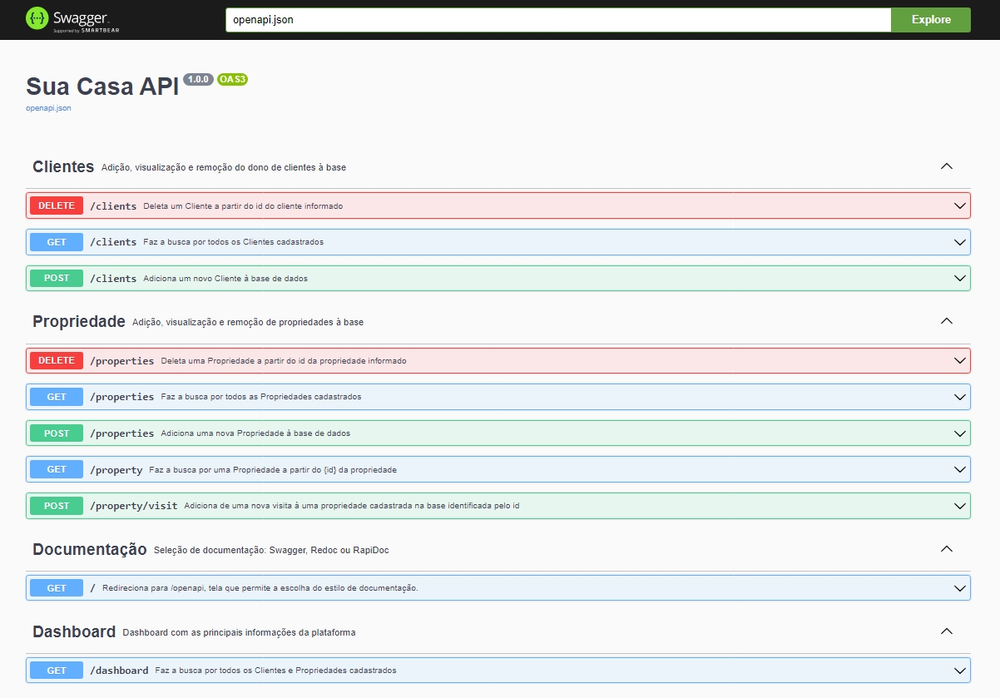

# API - SUA CASA

A **API - Sua Casa** fornece serviços para imobiliarias, facilitando o contato com o cliente.

## Principais funcionalidades
- **Gerenciamento de propriedades:** criação e exclusão de propriedades de diversos tipos, como casas, apartamentos, lotes, etc;
- **Gerenciamento de clientes:** criação e exclusão de clientes;
- **Agendamento de visitas:** agende e marque visitas as propriedades;
- **Dashboard:** principais informações da aplicação.



---
## Tecnologias e Arquitetura
- **Flask**: micro-framework python;
- **SQLite3**: banco de dados;
- **MVC**: modelo arquitetural amplamente utilizado e de fácil implementação;
- **Documentação**: atráves da lib `flask-openapi3` temos aqui uma rica documentação, podende ser: Swagger, ReDoc ou RapiDoc.

---
## Como rodar o projeto

### LOCALMENTE
Primeiramente temos que instalar as libs presentes em `requirements.txt` com o seguinte comando:
  ```
  pip install -r requirements.txt
  ```
Depois que as libs foram instaladas, podemos executar o projeto com o comando:
  ```
  flask run --host 0.0.0.0 --port 5000
  ```
  ou em modo de desenvolvimento:
  ```
  flask run --host 0.0.0.0 --port 5000 --reload
  ```
---
### DOCKER
Primeiro crie a imagem com o seguinte comando:
```
  docker build -t back .
```

depois rode a imagem com o seguinte comando:
```
  docker run -p 0.0.0.0:5000:5000 --name back back
```

Abra o [http://localhost:5000/](http://localhost:5000/) no navegador para verificar o status da API em execução.